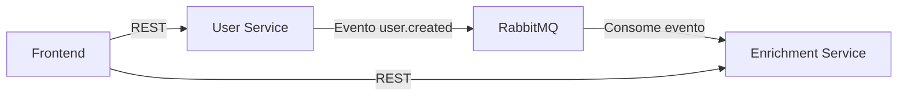

# Enrichment Service

Serviço de enriquecimento de perfis de usuário que consome eventos de criação de usuário e adiciona dados sociais fictícios. Este serviço é parte de uma arquitetura de microsserviços, onde ele é responsável por enriquecer os dados dos usuários com informações de redes sociais.

## 🏗️ Arquitetura do Sistema

O sistema é composto por três componentes principais:

1. **Frontend (React)**

   - Interface de usuário
   - Comunica com o user-service via REST

2. **User Service**

   - Gerencia dados básicos dos usuários
   - Usa PostgreSQL como banco de dados
   - Publica eventos no RabbitMQ quando um usuário é criado

3. **Enrichment Service** (este serviço)
   - Consome eventos do RabbitMQ
   - Enriquece dados dos usuários
   - Usa MongoDB para persistência
   - Expõe API REST para consulta de dados enriquecidos

### Fluxo de Comunicação



## 🚀 Como Executar

### Pré-requisitos

- Docker e Docker Compose instalados
- Git instalado

### Passo a Passo

1. **Clone os repositórios**

```bash
# User Service
git clone git@github.com:carinavbritto/laravel-user-service.git
cd user-service

# Enrichment Service
git clone git@github.com:carinavbritto/nestjs-enrichment-service.git
cd enrichment-service
```

2. **Configure as variáveis de ambiente**
   - Crie um arquivo `.env` na raiz do projeto com as seguintes variáveis:

```env
# MongoDB
MONGODB_URI=mongodb+srv://carinavbritto:<PASSWORD>@cluster0.kylfibw.mongodb.net/enrichment-service?retryWrites=true&w=majority&appName=Cluster0

# RabbitMQ
RABBITMQ_URL=amqp://user-service-rabbitmq:5672

# Application
PORT=3000
NODE_ENV=development
```

3. **Inicie os serviços**

```bash
# No diretório do User Service
docker-compose up -d

# No diretório do Enrichment Service
docker-compose up -d
```

4. **Verifique se os serviços estão rodando**

```bash
docker-compose ps
```

## 🔍 Testando a Aplicação

### 1. Criar um usuário (User Service)

```bash
curl -X POST http://localhost:8000/users \
  -H "Content-Type: application/json" \
  -d '{
    "name": "João Silva"
  }'
```

### 2. Consultar dados enriquecidos (Enrichment Service)

```bash
curl -X GET http://localhost:3000/users/enriched/123e4567-e89b-12d3-a456-426614174000
```

## 📊 Acessando os Serviços

- **User Service API**: http://localhost:8000
- **Enrichment Service API**: http://localhost:3000
- **RabbitMQ Management UI**: http://localhost:15672
  - Usuário: guest
  - Senha: guest

## 🛠️ Tecnologias Utilizadas

- **NestJS**: Framework Node.js para construção de aplicações escaláveis
- **MongoDB**: Banco de dados NoSQL para persistência
- **RabbitMQ**: Message broker para comunicação assíncrona
- **Docker**: Containerização e orquestração
- **TypeScript**: Superset JavaScript com tipagem estática

## ⚠️ Troubleshooting

### Serviço não inicia

```bash
# Verifique os logs
docker-compose logs -f app
```

### Erro de conexão com RabbitMQ

```bash
# Verifique se o RabbitMQ está rodando
docker-compose ps

# Verifique os logs do RabbitMQ
docker-compose logs -f rabbitmq
```

## 📁 Estrutura do Projeto

```
src/
  ├── users/
  │   ├── controllers/    # Endpoints REST
  │   ├── services/      # Lógica de negócio
  │   ├── repositories/  # Acesso ao MongoDB
  │   ├── schemas/       # Schemas do MongoDB
  │   └── consumers/     # Consumidores RabbitMQ
  ├── app.module.ts      # Configuração principal
  └── main.ts           # Ponto de entrada
```
